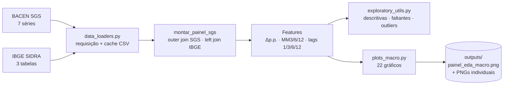
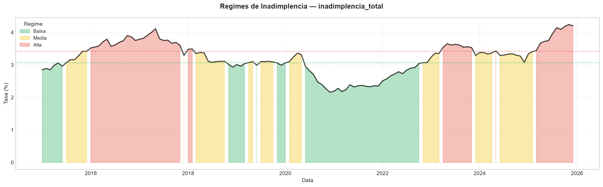
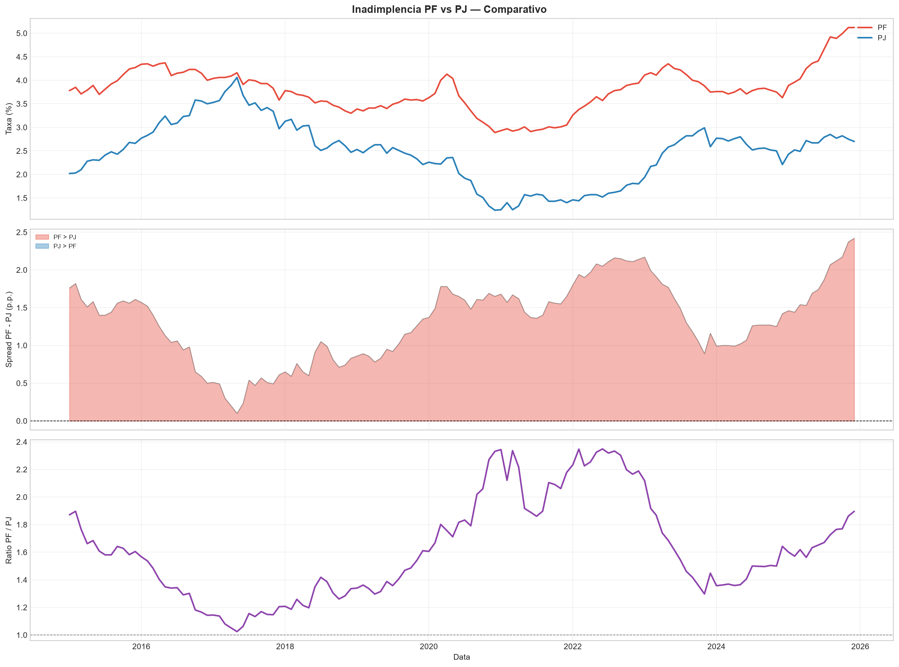
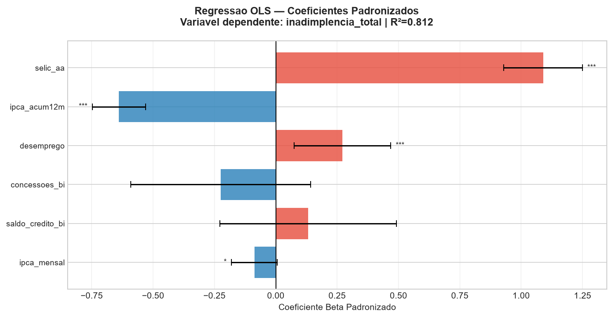
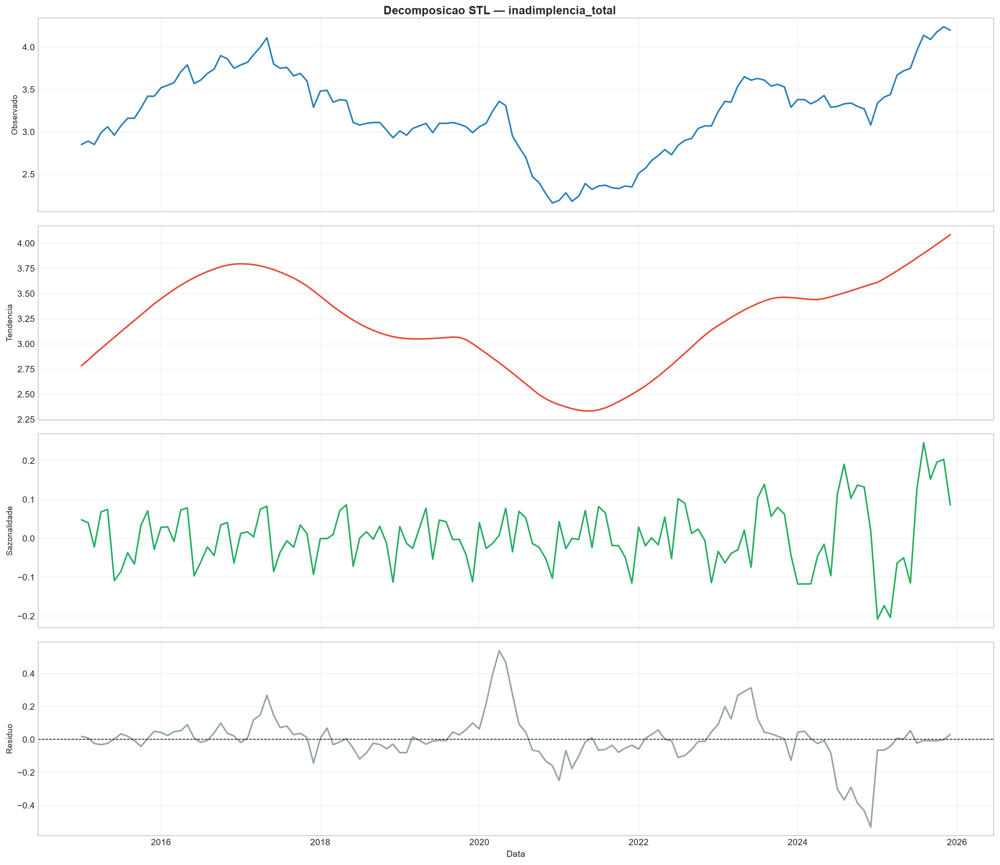
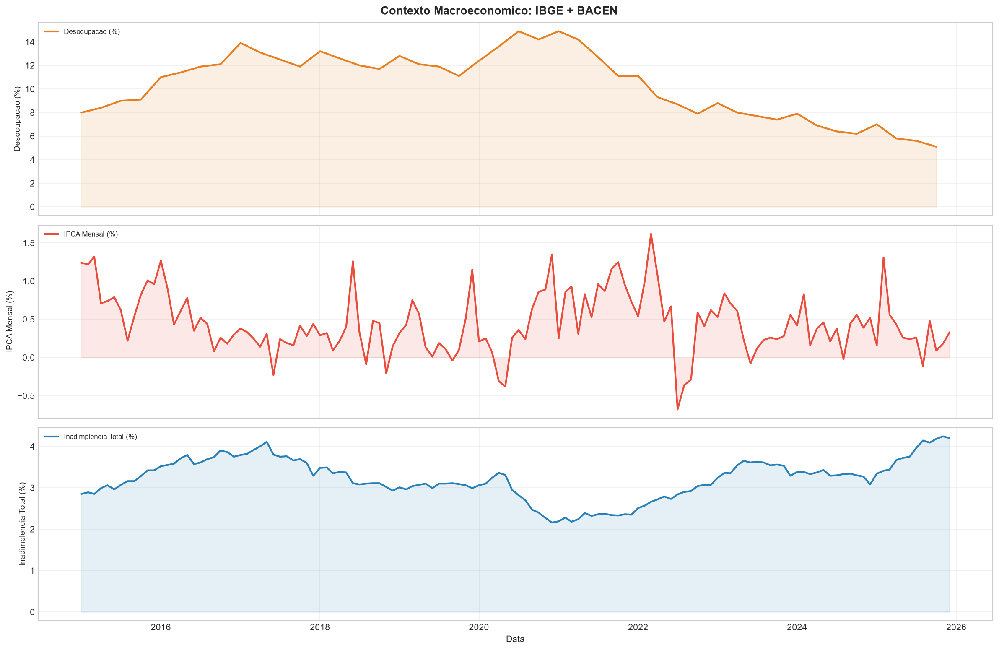
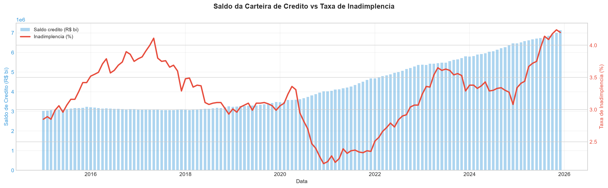
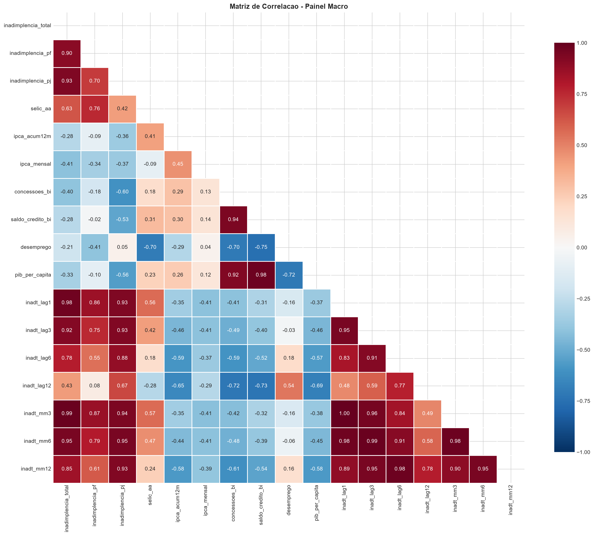
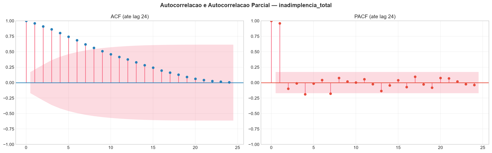
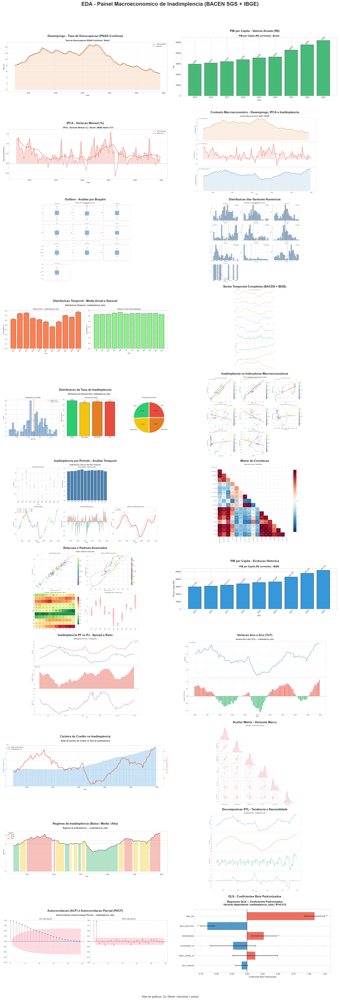

<div align="center">

# Mapa da Inadimplência Brasileira

### Análise exploratória macroeconômica com dados oficiais do BACEN e do IBGE (2015–2025)

[](https://www.python.org/)
[](https://pandas.pydata.org/)
[](https://www.statsmodels.org/)
[](https://www3.bcb.gov.br/sgspub/)
[](https://sidra.ibge.gov.br/)
[](https://opensource.org/licenses/MIT)

[Visão geral](#visão-geral) · [Fontes](#fontes-de-dados) · [Achados](#principais-achados) · [Análises](#análises-geradas) · [Qualidade](#qualidade-dos-dados) · [Limitações](#limitações-conhecidas) · [Como executar](#como-executar)

</div>

---

## Visão geral

<table>
<tr>
<td align="center"><b>132</b><br/>meses (jan/2015 – dez/2025)</td>
<td align="center"><b>10</b><br/>séries oficiais</td>
<td align="center"><b>3</b><br/>APIs públicas</td>
<td align="center"><b>22</b><br/>gráficos + painel</td>
<td align="center"><b>4,24%</b><br/>pico da série (nov/2025)</td>
</tr>
</table>

| Pergunta | Resposta em uma linha |
|---|---|
| **Como evoluiu a inadimplência?** | Ciclo completo: pico de **4,11%** em 2017, mínima de **2,16%** em dez/2020 e novo recorde de **4,24%** em nov/2025 |
| **PF ou PJ, quem atrasa mais?** | PF acima de PJ em **100% dos 132 meses**; spread médio de **1,32 p.p.**, que chegou a **2,42 p.p.** em dez/2025 |
| **Qual indicador antecipa a inadimplência?** | **Selic**: a correlação cresce com a defasagem e chega a **r = 0,88 com 9 meses de atraso** |
| **A série tem memória?** | Sim: autocorrelação de **0,976** no lag 1. O melhor preditor do mês seguinte é o mês atual |
| **Há sazonalidade?** | Fraca: diferença de só **0,21 p.p.** entre o mês mais alto (maio) e o mais baixo (janeiro) |



---

## Fontes de Dados

Todas as fontes são **públicas, gratuitas e sem autenticação**. Na primeira execução as respostas ficam em cache em `data/*.csv`, e as execuções seguintes não acessam as APIs.

| Fonte | Código | Série | Frequência |
|---|:---:|---|:---:|
| **BACEN SGS** | `21082` | Inadimplência total da carteira (% > 90 dias) | Mensal |
| | `21084` | Inadimplência Pessoa Física | Mensal |
| | `21083` | Inadimplência Pessoa Jurídica | Mensal |
| | `4189` | Selic acumulada no mês, anualizada (% a.a.) | Mensal |
| | `13522` | IPCA acumulado em 12 meses | Mensal |
| | `20631` | Concessões de crédito (R$ milhões) | Mensal |
| | `20539` | Saldo da carteira de crédito (R$ milhões) | Mensal |
| **IBGE SIDRA** | tab. `4099` | Taxa de desocupação PNAD Contínua | Trimestral → mensal (interpolação linear) |
| | tab. `6784` | PIB per capita, valores correntes | Anual |
| | tab. `1737` var. `63` | IPCA, variação mensal | Mensal |

---

## Principais Achados

### 1. Um ciclo completo em dez anos

<p align="center">
  
  <br/><sub>Inadimplência total classificada em regimes pelos percentis P33 e P66 da própria série.</sub>
</p>

| Fase | Período | O que aconteceu |
|---|---|---|
| **Alta** | 2015–2017 | Recessão: a série sobe de 2,85% para **4,11%** (mai/2017) |
| **Normalização** | 2018–2019 | Estabiliza em torno de 3,0% a 3,1% |
| **Queda atípica** | 2020–2021 | Mínima de **2,16%** em dez/2020, mesmo com o desemprego perto de 15%. O período coincide com auxílio emergencial, renegociações e juros na mínima histórica (Selic de **1,90%** em set/2020) |
| **Nova alta** | 2022–2025 | Com a Selic de volta a dois dígitos, a série sobe até o recorde de **4,24%** em nov/2025 |

Média anual: 2021 foi o ano mais baixo (**2,31%**) e 2025 o mais alto (**3,84%**).

### 2. A Selic antecipa a inadimplência

Correlação de Pearson entre a inadimplência total e cada indicador defasado *k* meses (amostra completa, 2015–2025):

| Indicador | k = 0 | k = 3 | k = 6 | k = 9 | k = 12 |
|---|:---:|:---:|:---:|:---:|:---:|
| **Selic** | 0,64 | 0,78 | 0,87 | **0,88** | 0,85 |
| IPCA 12m | −0,28 | −0,05 | 0,15 | 0,33 | **0,47** |
| Desemprego | −0,34 | −0,47 | −0,57 | −0,63 | −0,67 |
| Saldo de crédito | 0,17 | 0,18 | 0,21 | 0,24 | 0,27 |

A relação com a Selic é **quase o dobro mais forte com defasagem** do que no mesmo mês: o aperto monetário leva de 6 a 12 meses para aparecer nos atrasos acima de 90 dias. O IPCA segue o mesmo padrão e **troca de sinal** conforme a defasagem cresce.

> [!NOTE]
> **Desemprego com sinal negativo não quer dizer que desemprego reduz inadimplência.** A correlação é dominada por 2020–2021, quando o desemprego atingiu o pico ao mesmo tempo que medidas extraordinárias derrubaram a inadimplência. De 2022 a 2025, o desemprego caiu de 11% para 5% e a inadimplência subiu, puxada pelos juros. É um caso clássico de variável confundidora.

### 3. PF sempre acima de PJ, e o spread voltou a abrir

<p align="center">
  
</p>

- A PF ficou acima da PJ em **todos os 132 meses**;
- O spread quase se fechou em mai/2017 (~0,1 p.p.), quando a PJ bateu o seu máximo (**4,06%**);
- Em dez/2020 a PJ caiu para **1,24%**, a mínima da série, e a razão PF/PJ passou de **2,3×**;
- Em dez/2025, a PF está em **5,12%**, seu recorde, contra **2,70%** da PJ: a alta recente é **puxada pelas famílias**.

### 4. Modelo explicativo: Selic domina

<table>
<tr>
<td width="55%"></td>
<td>

OLS com variáveis padronizadas: inadimplência total contra os indicadores macro contemporâneos (**R² = 0,812**).

- **Selic**: β ≈ +1,09, maior efeito e significativo;
- **IPCA 12m**: β ≈ −0,64 (***);
- **Desemprego**: β ≈ +0,27 (***). Controlando pelos juros, o sinal **passa a ser positivo**, o esperado economicamente;
- Concessões e saldo **não são significativos**.

<sub>Modelo descritivo em séries não estacionárias: serve para ordenar a importância relativa, não como estimativa causal.</sub>

</td>
</tr>
</table>

### 5. Tendência forte, sazonalidade fraca

<p align="center">
  
</p>

A decomposição STL mostra que quase toda a variação está na **tendência**. O componente sazonal oscila em torno de ±0,1 p.p. na maior parte da série, e os maiores resíduos aparecem no choque do início da pandemia (2020) e na virada 2024/2025, que coincide com a quebra metodológica descrita em [Qualidade dos Dados](#qualidade-dos-dados). Com autocorrelação de **0,976** no lag 1 e **0,43** no lag 12, a série se presta mais a modelos de persistência (ARIMA/SARIMAX com Selic defasada) do que a modelos sazonais.

<details>
<summary><b>Mais gráficos: contexto macro, carteira vs. inadimplência, correlações e ACF/PACF</b></summary>

<p align="center"></p>
<p align="center"></p>
<sub>O saldo da carteira cresceu <b>2,36×</b>, de R$ 3,0 tri para R$ 7,1 tri. O eixo do gráfico mostra valores em R$ milhões (escala 1e6).</sub>
<p align="center"></p>
<p align="center"></p>
<p align="center"></p>

</details>

---

## Análises Geradas

`plots_macro.py` gera **22 gráficos** individuais, consolidados em `outputs/painel_eda_macro.png`:

| Bloco | Gráficos |
|---|---|
| **Contexto macro** | Desocupação PNAD, PIB per capita, IPCA mensal e painel comparativo com a inadimplência |
| **EDA base** | Boxplots, histogramas + KDE, médias por mês e por ano, séries completas com MM12 |
| **Classificação** | Distribuição da inadimplência em quartis (Baixa / Média-Baixa / Média-Alta / Alta) |
| **Bivariadas** | Scatter + regressão da inadimplência contra Selic, IPCA, desemprego, concessões e saldo |
| **Por período** | Boxplot por ano, sazonalidade mensal, séries anuais sobrepostas, variação em p.p. |
| **Correlação** | Heatmap triangular com lags (1, 3, 6, 12 meses) e médias móveis |
| **Avançadas** | Autocorrelação lag 1, MM3 vs. MM12, heatmap Ano × Mês, violin por ano |
| **Extensivas** | PF vs. PJ (spread e razão), variação YoY, carteira vs. inadimplência, pairplot, regimes P33/P66, **STL**, **ACF/PACF** e **OLS padronizado** |

Além dos gráficos, o console imprime estatísticas descritivas (com CV, assimetria e curtose), o relatório de faltantes, outliers por IQR e z-score e as correlações com p-valor.

---

## Qualidade dos Dados

| Verificação | Resultado |
|---|---|
| **Cobertura das séries SGS** | 7 séries completas: 132/132 meses |
| **Desemprego (PNAD)** | 130/132 meses: a PNAD trimestral ainda não cobre nov–dez/2025 |
| **PIB per capita** | Anual, disponível até 2023. Os 24 meses de 2024–2025 ficam nulos (18,2%), sem imputação |
| **Outliers (IQR 1,5×)** | Nenhum na inadimplência total; 3 meses na PF (out–dez/2025, os recordes recentes) e 1 na PJ (mai/2017, pico de 4,06%). São valores reais, então foram mantidos |
| **Outliers (\|z\| > 3)** | Nenhum em nenhuma série |
| **Joins** | SGS em *outer join* (cada série preserva seu histórico) e IBGE em *left join* sobre o eixo mensal do SGS |

> [!IMPORTANT]
> **Quebra metodológica em 2025.** O maior salto mensal da série (**+0,26 p.p.**, de dez/2024 para jan/2025) coincide com a entrada em vigor da Resolução CMN nº 4.966/2021, que mudou as regras contábeis de classificação e provisionamento de crédito. Parte da alta de 2025 pode refletir essa mudança, e não só a deterioração do crédito. Comparações entre antes e depois de 2025 devem ser feitas com cautela.

---

## Limitações Conhecidas

| Item | Situação |
|---|---|
| **Painel por modalidade/instituição (BACEN Olinda)** | ⚠️ **Desativado.** O código consulta `taxas-juros/.../TaxasJurosMensalPorInstituicaoFinanceira`, que retorna **404**. O serviço real (`taxaJuros/versao/v2`) só publica **taxas de juros** por modalidade e instituição e não tem os campos `TaxaInadimplencia`, `NumeroDeContratos` e `BaseDeCalculo` que o painel usa. O pipeline detecta a falha e segue só com o painel macro. Os gráficos de `plots_analise.py` precisam de uma nova fonte de inadimplência por modalidade para voltar a funcionar |
| **Interpolação do desemprego** | A interpolação linear trimestre → mês suaviza a série. Serve como variável explicativa, não para análises de curto prazo |
| **Correlação ≠ causalidade** | As séries são não estacionárias e compartilham tendências. As correlações e o OLS descrevem associações, não efeitos causais |
| **Quebra de 2025** | Ver nota em [Qualidade dos Dados](#qualidade-dos-dados) |

---

## Estrutura do Repositório

```text
.
├── docs/img/                       # gráficos exportados para este README
└── inadimplencia_br/
    ├── eda_br_inadimplencia.py     # orquestrador: coleta → painel → análises → PNGs
    ├── requirements.txt
    ├── src/
    │   ├── config.py               # códigos SGS, período, limiares e parâmetros de saída
    │   ├── constants.py            # meses em PT-BR, paleta
    │   ├── data_loaders.py         # BACEN SGS, BACEN Olinda, IBGE SIDRA (com cache CSV)
    │   ├── pipeline_utils.py       # montar_painel_sgs(): joins das séries
    │   ├── exploratory_utils.py    # descritivas, faltantes, outliers
    │   ├── plots_macro.py          # 22 gráficos do painel macro
    │   ├── plots_analise.py        # gráficos por modalidade (Olinda, ver limitações)
    │   └── visualization_utils.py  # PainelSaida: PNGs individuais + painel consolidado
    ├── data/                       # cache CSV (gerado na 1ª execução, ignorado pelo git)
    └── outputs/                    # gráficos (gerados, ignorados pelo git)
```

---

## Como Executar

```bash
git clone https://github.com/XAKCN/inadimplencia_br.git
cd inadimplencia_br/inadimplencia_br

python -m venv venv
venv\Scripts\activate          # Windows
# source venv/bin/activate     # Linux/Mac

pip install -r requirements.txt
python eda_br_inadimplencia.py
```

A primeira execução consulta as APIs, e as seguintes usam o cache em `data/`. Para forçar uma nova coleta, apague os CSVs de `data/`.

<details>
<summary><b>Configuração (<code>src/config.py</code>)</b></summary>

```python
SGS = {'inadimplencia_total': 21082, 'inadimplencia_pf': 21084, 'inadimplencia_pj': 21083,
       'selic_aa': 4189, 'ipca_acum12m': 13522, 'concessoes_bi': 20631, 'saldo_credito_bi': 20539}

PERIODO  = {'data_inicial': '01/01/2015', 'data_final': '31/12/2025', ...}
LIMIARES = {'outlier_iqr': 1.5, 'outlier_zscore': 3.0, 'corr_forte': 0.7, 'corr_moderada': 0.4}
SAIDA    = {'dpi_miniatura': 110, 'dpi_painel': 150, 'olinda_top': 50_000}
```

</details>

**Dependências:** pandas, numpy, matplotlib, seaborn, scipy, requests e statsmodels (STL, ACF/PACF e OLS).

---

## Próximos Passos

- [ ] Modelo preditivo **SARIMAX** com a Selic defasada em 6 a 9 meses como variável exógena
- [ ] Tratar a quebra de 2025 com uma dummy de intervenção a partir de jan/2025
- [ ] Reconstruir o painel por modalidade com as séries SGS de inadimplência por modalidade (cartão, consignado, veículos, cheque especial) no lugar do Olinda

---

<div align="center">

Dados: [Banco Central do Brasil](https://dadosabertos.bcb.gov.br/) · [IBGE](https://sidra.ibge.gov.br/) · Projeto de estudo em Data Science Financeira · Licença MIT

</div>
